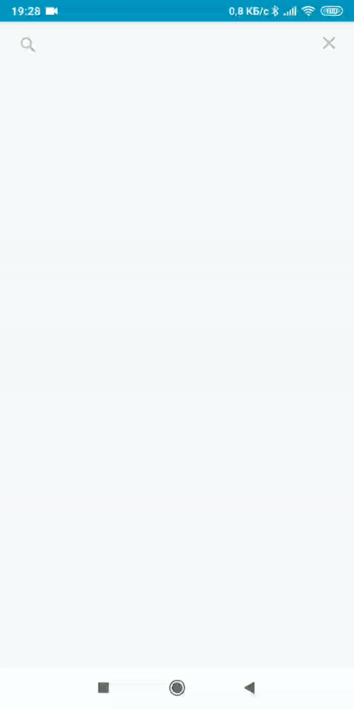

# Dictionary (SkyEng test)
## Пример

## Установка
- Кнопка clone -> копировать путь
- Android Studio -> File -> New -> Project From Version Control (Windows)
- Или через любой git-терминал -> git clone <путь>
## Используемые библиотеки
- Kotlinx-coroutines - ассинхронная работа с сетью
- Glide - загрузка изображений
- Retrofit2, Okhttp3 - работа с сетью
- Navigation graph - навигация фрагментов
- LiveData, ViewModel - реализация паттерна Observer
## Задание
Реализовать приложение для поиска переводов слов в словаре, состоящее из двух экранов:
- Экран, содержащий форму поиска слова и таблицу отображения результатов
- Экран, отображающий подробную информацию о слове (текст, перевод и картинка, остальные поля по желанию), открывается по нажатию на ячейку в таблице с результатами поиска
Загрузку данных о словах производить при помощи публичного API, документация находится [здесь](https://dictionary.skyeng.ru/doc/api/external)
###### Требования:
- Для Android использовать Kotlin
- К коду приложить Readme, где коротко описывается как собрать и запустить код
- Результат выполнения загрузить на любой Git-хостинг и прислать ссылку, zip-файлы и прочие форматы не принимаются
- Использование сторонних библиотек разрешается, в этом случае в Readme нужно указать зачем она используется
- Приложение должно корректно обрабатывать повороты экрана
- К приложению должен быть написан хотя бы 1 юнит-тест
- Реализованная функциональность должна быть максимально близка к production-состоянию
- UI приложения должен соответствовать гайдлайнам платформы.
